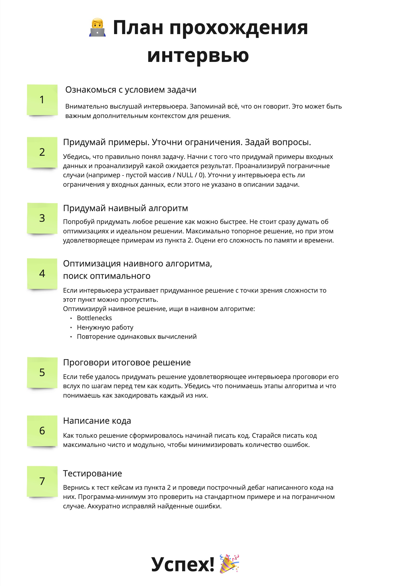

# learn-algorithms
Бесплатный минимально необходимый план изучения алгоритмов и структур данных для прохождения интервью в компанию мечты.
## Disclaimer
В этой заметке не будет рассуждений о том нужны ли алгоритмы разработчику. (**Моё мнение**: зависит от того чем именно вы занимаетесь). 

Также мы не будем рассуждать о корректности такого подхода к оценке кандидатов. (**Моё мнение**: каждая компания вольна строить найм как хочется, рынок всё решит)

Если хочется получить ответы на эти вопросы рекомендую к просмотру видео - [Алгоритмы и структуры данных простыми словами. Зачем осваивать алгоритмы?](https://www.youtube.com/watch?v=CB9bS46vl04).

## Что такое алгоритмческая секция?
Интервьюер даёт задачу (одну или несколько) в формате: есть **входные данные** (А), необходимо написать функцию которая принимает А, внутри себя производит набор действий  и возвращает результат (B). 

**Цель кандидата**: написать код этой функции за отведенное для этого время. Оценить алгоритмическую сложность по времени и по памяти.

## Что оценивается на алгоритмической секции?
При правильном проведении из нее можно извлечь ценные артефакты о том:
- Как кандидат мыслит, как рассуждает о проблеме (в ситуации когда проблема незнакомая и время ограничено это очень заметно)
- Как задает вопросы и какие это вопросы
- Как воспринимает обратную связь, прислушивается ли он к подсказкам
- Насколько глубоки и широки знания кандидата в Computer Science
- Как кандидат пишет код (пишет ли тесты, каких стандартов оформления придерживается)
## Факторы влияющие на успех кандидата при прохождении интервью:
- Количество решенных задач (Практика)
- Широта и глубина знаний по алгоритмам и структурам данных (Теория)
- Умение вести диалог с интервьюером
- Аналитические способности / интуиция (следствие первых 2х пунктов)
- Везение (попадется ли вам задача которую вы уже видели)

**Задача кандидата**: максимизировать свои шансы по каждому из пунктов.

## Какие основные этапы алгоритмического собеседования?

## Повышаем шансы на успех
### Практикуемся в решении задач
Не будем переизобретать велоссипед. Берем любой сайт с задачками и решаем.
Например:
- LeetCode
- Codewars
- Codeforces
- CodeWars

Для LeetCode советую использовать таблицу по ссылке чтобы плавно идти от простого к сложному без резких перепадов. 

С ростом опыта полезно **ставить таймер**, чтобы искусственно воспроизводить атмосферу настоящего интервью.

Необходимый минимум задач в "ширину": 
- [Curated List of Top 75 LeetCode Questions to Save Your Time](https://www.teamblind.com/post/New-Year-Gift---Curated-List-of-Top-75-LeetCode-Questions-to-Save-Your-Time-OaM1orEU)
- [NeetCode 150 Roadmap](https://neetcode.io/roadmap)

Problem solving patterns (шаблоны решения задач):
- [14 шаблонов, которые помогут ответить на любой вопрос по коду на собеседовании](https://tproger.ru/translations/14-templates-to-answer-interview-questions)
- [A pattern-based approach for learning technical interview questions](https://seanprashad.com/leetcode-patterns/)
- [Crack LeetCode, not only how, but also why.](https://github.com/labuladong/fucking-algorithm/tree/english)

### Не забываем про теорию
Однажды наступит такой момент когда задачи на LeetCode перестанут решаться, потому что не получается придумать ничего кроме наивного/брутфорс решения. Значит пришло время искать идеи где-то кроме своей головы. Например в разделе Discuss на LeetCode :) 

Но разобраться проблематично без предварительного изучения того как устроена структура данных или алгоритм. Тут то нам и придут на помощь книги/курсы/справочники по алгоритмам.

#### Основы
Books:
- [(Book, Python, FREE) Problem Solving with Algorithms and Data Structures](https://runestone.academy/ns/books/published/pythonds/index.html)
- [Книга «Грокаем алгоритмы. Иллюстрированное пособие для программистов и любопытствующих»](https://habr.com/ru/companies/piter/articles/323310/)

Сложность алгоритмов:
- [(FREE) Big-O Algorithm Complexity Cheat Sheet (Know Thy Complexities!)](https://www.bigocheatsheet.com/)
- [(FREE) Хорошие статья с примерами про оценку сложности алгоритмов](https://habr.com/ru/articles/782608/)

Гайды
- [(FREE) The Definitive Guide to Data Structures for Coding Interviews](https://www.byte-by-byte.com/data-structures/)
- [(FREE) Open Source resource for learning Data Structures & Algorithms and their implementation in any Programming Language
](https://github.com/TheAlgorithms)

 Отдельно выделю сервис [algorithm-visualizer.org](https://algorithm-visualizer.org/) - с его помощью можно визуализировать, работу того или иного алгоритма. Поддерживаются примеры на  C++ / JS / Java. Попробуйте поискать задачу с которой не смогли разобраться на этом сайте :)
#### Продвинутый уровень теории (для олимпиад и FAANG интервью)
- [(FREE) A complete computer science study plan to become a software engineer.](https://github.com/jwasham/coding-interview-university)
- [(FREE) Algorithms for Competitive Programming](https://cp-algorithms.com/) или http://e-maxx.ru/algo/
- [(FREE) Competitive Programmer’s Handbook](https://cses.fi/book/book.pdf) или [Антти Лааксонен: Олимпиадное программирование](https://www.labirint.ru/books/776224/)

### Проходим пробные интервью

По своему опыту могу сказать что собеседование это огромный стресс для организма. И часто этот стресс мешает показать свои настоящие знания. Поэтому для достижения успеха нужно научиться работать со стрессом и держать его под контролем. В этом отлично помогают mock interview - пробные собеседования ничем не отличающиеся от настоящих с той лишь разницей что ошибка ничего не стоит для кандидата :) После нескольких попыток организм привыкает и на реальном собеседовании справляться с эмоциями становится в разы легче.

Бесплатные mock interview на английском языке - [Pramp - Practice Mock Interviews & Coding Problems - Land Top Jobs](https://www.pramp.com/#/)
