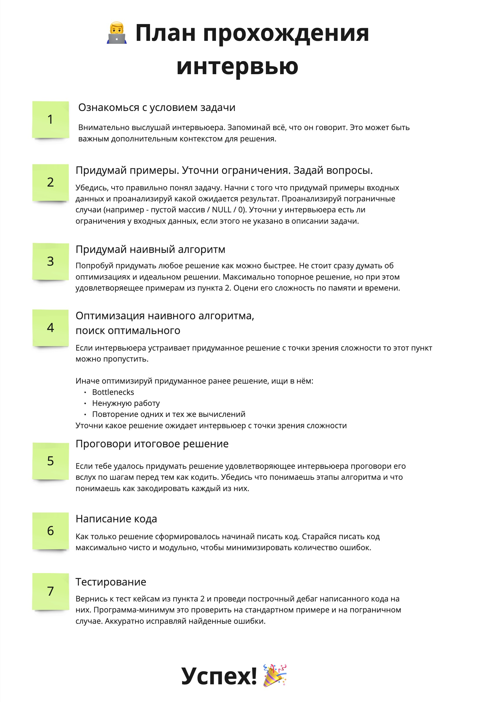

 

Бесплатный, минимально необходимый план подготовки к алгоритмическому интервью в компанию мечты. Для любого уровня подготовки.
## Disclaimer
В этой заметке не будет рассуждений о том нужны ли алгоритмы разработчику. (**Моё мнение**: зависит от того чем именно вы занимаетесь). 

Также мы не будем рассуждать о корректности такого подхода к оценке кандидатов. (**Моё мнение**: каждая компания вольна строить найм как хочется, рынок всё решит)

Если хочется получить ответы на эти вопросы рекомендую к просмотру видео - [Алгоритмы и структуры данных простыми словами. Зачем осваивать алгоритмы?](https://www.youtube.com/watch?v=CB9bS46vl04).
## Предложения по содержанию
Если у вас есть предложения по наполнению репозитория, не стесняйтесь:
- Предлагать идеи через issues ✅
- Предлагать конкретные изменения через PR ✅
# Что такое алгоритмическое интервью?
Интервьюер даёт задачу (одну или несколько) в формате: есть **входные данные** (А), необходимо написать функцию которая принимает А, внутри себя производит набор действий  и возвращает результат (B). 

**Цель кандидата**: написать код этой функции за отведенное для этого время. Оценить алгоритмическую сложность по времени и по памяти.

# Что оценивается на алгоритмическом интервью?
При правильном проведении из нее можно извлечь ценные артефакты о кандидате:
- Как мыслит, как рассуждает о проблеме (в ситуации когда проблема незнакомая и время ограничено это очень заметно)
- Как задает вопросы и какие это вопросы
- Как воспринимает обратную связь, прислушивается ли он к подсказкам
- Насколько глубоки и широки знания кандидата в Computer Science
- Как кандидат пишет код (пишет ли тесты, каких стандартов оформления придерживается)
# Факторы влияющие на успех
- Количество решенных задач (Практика)
- Широта и глубина знаний по алгоритмам и структурам данных (Теория)
- Умение вести диалог с интервьюером
- Аналитические способности / интуиция (следствие первых 2х пунктов)
- Везение (попадется ли задача которую вы уже видели)

**Задача кандидата**: максимизировать свои шансы по каждому из пунктов.

# Какие основные этапы алгоритмического собеседования?
Основные этапы из которых состоит собеседование представлены на картинке. Старайся всегда придерживаться этого плана во время реального собеседования. Не пропускай шаги.

# Подготовка
## Практикуемся в решении задач
Не будем изобретать велоссипед. Берем любой сайт с задачками и решаем.
Например:
- LeetCode
- Codeforces
- CodeWars
- HackerRank

Если вы начинающий и только погружаетесь в алгоритмы и задачи и используете LeetCode настоятельно рекомендую использовать [таблицу](https://docs.google.com/spreadsheets/d/1FW-_sPhLO-NJRW_qzRYC6pT_n0jxkFj5KS1-4-ZbagI/edit?usp=sharing), для выбора задачек. Она позволит плавно идти от простого к сложному без резких перепадов. 

После того как вы освоились на одной из платформ нужно браться за самые популярные алгоритмические задачи:
- [Curated List of Top 75 LeetCode Questions to Save Your Time](https://www.teamblind.com/post/New-Year-Gift---Curated-List-of-Top-75-LeetCode-Questions-to-Save-Your-Time-OaM1orEU)
- [NeetCode 150 Roadmap](https://neetcode.io/roadmap)

Также важно постепенно изучить популярные паттерны решения алгоритмических задач:
- [14 шаблонов, которые помогут ответить на любой вопрос по коду на собеседовании](https://tproger.ru/translations/14-templates-to-answer-interview-questions)
- [A pattern-based approach for learning technical interview questions](https://seanprashad.com/leetcode-patterns/)
- [Crack LeetCode, not only how, but also why.](https://github.com/labuladong/fucking-algorithm/tree/english)
## Не забываем про теорию
Однажды наступит такой момент когда задачи перестанут поддаваться, потому что не получается придумать ничего кроме наивного/брутфорс решения. Значит пришло время искать идеи где-то кроме своей головы. Например в разделе Discuss на LeetCode :) 

Но разобраться проблематично без предварительного изучения того как устроена структура данных или алгоритм. Тут то нам и придут на помощь книги/курсы/справочники.

### Основы
Сложность алгоритмов:
- [(FREE) Big-O Algorithm Complexity Cheat Sheet (Know Thy Complexities!)](https://www.bigocheatsheet.com/)
- [(FREE) Хорошие статья с примерами про оценку сложности алгоритмов](https://habr.com/ru/articles/782608/)

Книги:
- [(FREE) Problem Solving with Algorithms and Data Structures using Python](https://runestone.academy/ns/books/published/pythonds/index.html)
- [«Грокаем алгоритмы. Иллюстрированное пособие для программистов и любопытствующих»](https://habr.com/ru/companies/piter/articles/323310/)

Гайды и репозитории:
- [(FREE) The Definitive Guide to Data Structures for Coding Interviews](https://www.byte-by-byte.com/data-structures/)
- [(FREE) Реализация алгоритмов и структур данных на популярных языках программирования](https://github.com/TheAlgorithms)
Курсы:
- [(FREE) Основы алгоритмов от Яндекс.Образования](https://education.yandex.ru/handbook/algorithms)

Отдельно выделю сервис [algorithm-visualizer.org](https://algorithm-visualizer.org/) - с его помощью можно визуализировать, работу того или иного алгоритма. Поддерживаются примеры на  C++ / JS / Java. Попробуйте поискать задачу с которой не смогли разобраться на этом сайте :)
### Продвинутый уровень (для олимпиад и FAANG)
Бесплатные курсы:
- [(FREE) Алгоритмы: теория и практика. Методы](https://stepik.org/course/217/promo)
- [(FREE) Алгоритмы: теория и практика. Структуры данных](https://stepik.org/course/1547/promo)
-  (FREE) Algorithms by Robert Sedgewick [Part 1](https://www.coursera.org/learn/algorithms-part1) & [Part 2](https://www.coursera.org/learn/algorithms-part2)
- [(FREE) Analysis of Algorithms by Robert Sedgewick](https://www.coursera.org/learn/analysis-of-algorithms)

Гайды и справочники:
- [(FREE) A complete computer science study plan to become a software engineer.](https://github.com/jwasham/coding-interview-university)
- [(FREE) Algorithms for Competitive Programming](https://cp-algorithms.com/) или [(FREE) http://e-maxx.ru/algo/](http://e-maxx.ru/algo/)

Книги:
- [(FREE) С. Дасгупта, Х. Пападимитриу, У. Вазирани. Алгоритмы](https://alexanderskulikov.github.io/files/algorithms_href.pdf)
- [(FREE) Competitive Programmer’s Handbook](https://cses.fi/book/book.pdf) или [Антти Лааксонен: Олимпиадное программирование](https://www.labirint.ru/books/776224/)
# Пробное интервью

По своему опыту могу сказать что собеседования это стресс для организма. И часто он мешает показать себя на 100%. Поэтому для достижения успеха важно научиться преодолевать стресс и держать его под контролем. В этом могут помочь mock interview - пробные собеседования ничем не отличающиеся от настоящих с той лишь разницей что ошибка ничего не стоит для вас :)
Варианты
- У вас есть друг который работает в BigTech вы можете попросить его провести пробное интервью для вас.
- Можете воспользоваться услугами ментора. Или найти человека с релевантным опытом в тематическом сообществе.
- Воспользоваться [Pramp - Practice Mock Interviews & Coding Problems - Land Top Jobs](https://www.pramp.com/#/).
# Дополнительные ссылки вдохновившие меня на этот гайд
- [(FREE) «Подготовка к алгоритмическому собеседованию» от Яндекс.Практикум](https://practicum.yandex.ru/algorithms-interview/)
- [(FREE) Хочу работать в Google: Read Me First! - Методичка по подготовке к интервью в Google от сотрудника Google :)](InterviewPreparationGuide.pdf)
- [(FREE) Data Fest² Minsk 2018: Владимир Игловиков, Как быстро надо бежать, чтобы не отстать: ML edition](https://www.youtube.com/watch?v=v6Wv01GJQnI)
- [(FREE) Как попасть в Google: инструкция по подготовке](https://dou.ua/lenta/articles/google-interview/)
- Книга Cracking the Coding Interview (переведена на русский как "Карьера программиста"
